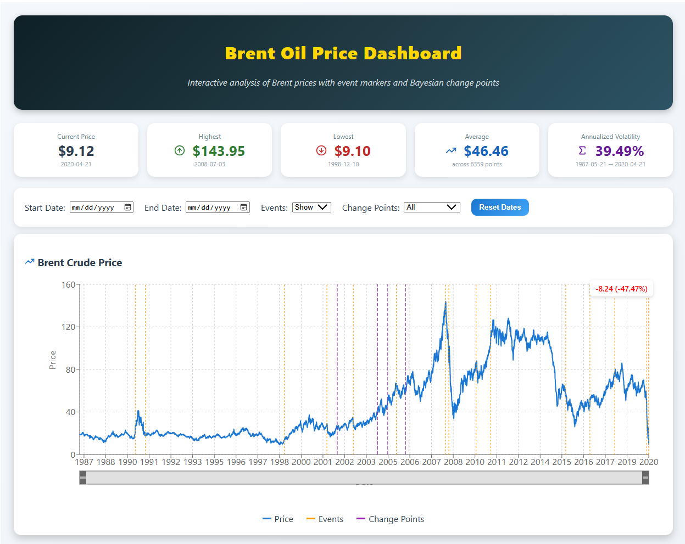
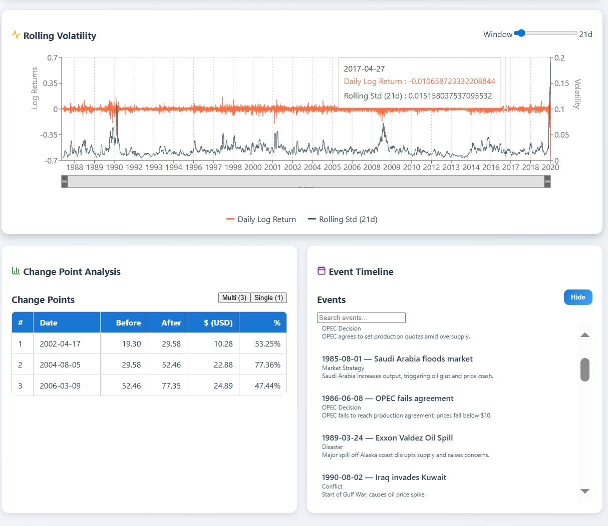

# Brent Oil Price Analysis & Dashboard

## Overview
This project analyzes historical Brent oil prices, detects structural change points, and correlates these changes with significant geopolitical and economic events. The results are presented in an **interactive React dashboard** powered by a **Flask API backend**.

---

## Laying the Foundation for Brent Oil Price Analysis

### Objective
Prepare data, understand modeling concepts, and plan the full analysis pipeline.

### Workflow
1. **Data Collection & Cleaning**
   - Historical Brent oil prices preprocessed into `brent_oil_log_returns.csv`.
2. **Feature Engineering**
   - Computed **Log Returns** for stationarity.
   - Added rolling mean & standard deviation for volatility analysis.
3. **Stationarity Testing**
   - ADF test confirmed log returns are stationary (p-value ≈ 0.000).
4. **Event Data Compilation**
   - 26 major events from EIA, OPEC, and historical archives.
5. **Model Planning**
   - Bayesian Change Point Detection (PyMC3) selected for structural break detection.

---

##  Backend Development (Flask API)

### Objective
Create a backend to serve:
- Historical Prices
- Event Data
- Single Change Point Detection Results
- Multiple Change Point Detection Results
- Combined Summary Endpoint

### API Endpoints
| Endpoint           | Description                                   |
|--------------------|-----------------------------------------------|
| `/api/prices`      | Returns historical Brent oil price data       |
| `/api/events`      | Returns curated oil market events             |
| `/api/single_cp`   | Returns single detected change point          |
| `/api/multi_cp`    | Returns multiple detected change points       |


---

## Frontend Development (React)

### Objective
Build an **interactive dashboard** to visualize:
- **Price Trends** over time
- **Log Returns** (Volatility) over time
- **Event Frequency** by year/type
- **Change Point Impacts** (% change before/after)
- **Tabular Data** for events & change points

### Key Features
- Filter by **date range** & change point type
- Hover tooltips for precise data points
- Color-coded tables and clean layout
- Multiple charts for better insights

---

## Dashboard Structure
- **Header Controls** — Date range & CP filter
- **Price Chart** — Prices with change point markers
- **Log Return Chart** — Daily log returns over time
- **Event Frequency Chart** — Events by year
- **Impact Charts** — % change before/after change points
- **Tables** — Single CP, Multi CP, and Events

---

## Data Sources
- Brent oil price data from **EIA** & public historical datasets
- Event data compiled from **OPEC reports, news archives, EIA**

---

## How to Run Locally

### Backend

```bash
cd dashboard/backend
pip install -r requirements.txt
python app.py
```

### Frontend

```bash
cd dashboard/frontend
npm install
npm start
```

Access the dashboard at: [http://localhost:3000](http://localhost:3000)

--- 


